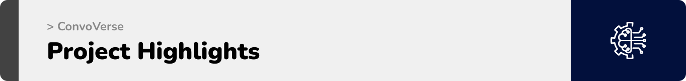
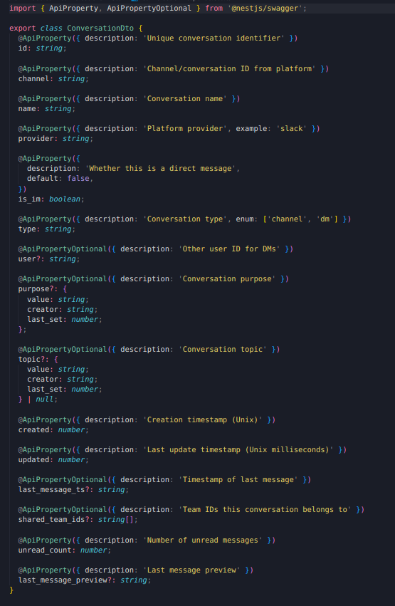

  
<!-- project overview -->

> **ConvoVerse** is an AI-powered solution that brings all your conversations in one place.
It unifies your Slack messages and Gmail threads into a single, intelligent dashboard, so you never waste time jumping between apps.

> 💡 The Problem  
Important conversations are scattered, tasks get buried, and deadlines slip through the cracks.

> ✅ The Solution  
**ConvoVerse** acts like your second brain. It automatically summarizes discussions, identifies action items, and surfaces the context you need keeping your team aligned, decisions faster, and critical information always visible.  

  

<!-- System Design -->

## ER Diagram
  

## System Architecture

## N8N Automation Workflow
### Slack  
  

### Gmail  

  

<!-- Project Highlights -->

## ConvoVerse Key Features  

- 🌐 **One Hub for All Conversations**  
Bring Slack, Gmail, and more into a single hub. Connect your account with just one click and enjoy seamless, real-time syncing across all platforms.  

- 🧾 **AI Side Assistant (Per Conversation)**  
Every conversation comes with its own AI-powered sidekick that summarizes what’s happening, highlights key points, and extracts tasks, events, and actions directly from the chat.  

- 🧠 **Global AI Assistant – Your Second Brain**  
Go beyond single conversations. Ask the global assistant about tasks, deadlines, or decisions across *all* your platforms no matter where the conversation started.  

- ⚡ **Real-Time Replying**  
Don’t just read, act. Reply to messages directly from ConvoVerse as if you were replying on Slack, Gmail, or any connected platform, making collaboration seamless and natural.  

  

<!-- Demo -->

### Landing Screen

| Landing Screen                          |
| --------------------------------------- |
|  |

### Login/Signup Screens

| Login screen                            | Signup screen                       |
| --------------------------------------- | ------------------------------------- |
|  |  |

### Live Integration Demo
| Integration               |       
| ----------------------------------- | 
|  |

### Unified Inbox Screen
| Unified Inbox Screen                       |
| --------------------------------------- |
|  |

### Live Conversation Demo
| Live Chat with Slack              |       
| ----------------------------------- | 
|  |

### Slack Conversations Screen                  
| Slack Chat Screen                       |  Gmail Chat Screen                      |
| --------------------------------------- | ------------------------------------- |
|    |  |

### Conversation AI Assistant Screen                  
| Summary Screen                       |  Actions Screen                      |
| --------------------------------------- | ------------------------------------- |
| |  |

### Live AI Assistant Demo
| Live Chat with AI assistant              |       
| ----------------------------------- | 
|  |

  

<!-- Development & Testing -->

### Services, Validation and Testing
|Testing                        |
| ------------------------------------- |
| |
  
| Services                            | Validation                       | 
| --------------------------------------- | ------------------------------------- |
|  |  | 

### Linear Workflow  
To keep development structured and transparent, every feature and bug fix was tracked through **Linear** and linked directly with GitHub:  

- 🔀 **Branching:** Each ticket started with a dedicated Git branch, keeping changes isolated and organized.  
- 📝 **Commits:** Code was committed regularly with clear, descriptive messages referencing the Linear ticket.  
- 📤 **Collaboration:** Changes were pushed to the remote repository, ensuring the team stayed in sync.  
- 🔍 **Pull Requests:** A PR was opened for review, enabling feedback, discussion, and quality checks.  
- 🔗 **Integration with Linear:** PRs were linked to their tickets, automatically updating progress and status.  
- ✅ **Done:** Once merged, the ticket was moved to **“Done”**, completing the development cycle smoothly.  

| Linear Workflow |
| ------------------------------------- |
|  |

  

<!-- Deployment -->

### Swagger API Documentation  

<a href="https://alinassarrr.github.io/convoverse/#/">Access the full API documentation here</a>  

The Swagger UI provides an **interactive playground** for developers:  
- 📖 Explore available endpoints with detailed descriptions.  
- 🛠️ Test requests and view real-time responses directly in the browser.  
- 🔑 Understand required parameters, authentication, and request/response formats.  
- 🚀 Speeds up integration and ensures consistent use of APIs across the project.  

| GET Conversations API                 | POST Ask AI Assistant API             | GET Latest Summary API                |
| --------------------------------------- | ------------------------------------- | ------------------------------------- |
|        |  |      |

  
