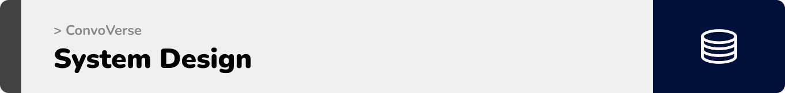

  

<!-- project overview -->

> **ConvoVerse** is an AI-powered solution that brings all your conversations in one place.
It unifies your Slack messages and Gmail threads into a single, intelligent dashboard, so you never waste time jumping between apps.
> ## 💡 The Problem
Important conversations are scattered, tasks get buried, and deadlines slip through the cracks.

> ## ✅ The Solution  
**ConvoVerse** acts like your second brain. It automatically summarizes discussions, identifies action items, and surfaces the context you need keeping your team aligned, decisions faster, and critical information always visible.  

  

<!-- System Design -->

### ER Diagram

  

<!-- Project Highlights -->

### 🚀 ConvoVerse Sexy Features

- 🌐 **Multi-Platform Integrations**
Bring all your conversations together! Seamlessly sync Slack and Gmail into one powerful, unified workspace.

- ⚡ **Real-Time Messaging**
Don’t just sync interact. Send and receive messages as a real user with instant, real-time updates across every channel.

- 🧠 **AI Assistant Your Second Brain**
Go beyond search. Chat with an AI that remembers everything across platforms ask about tasks, deadlines, or decisions and get actionable insights instantly.

  

<!-- Demo -->

### Landing Screen

| Landing Screen                          |
| --------------------------------------- |
|  |

### Login/Signup Screens

| Login screen                            | Signup screen                       |
| --------------------------------------- | ------------------------------------- |
|  |  |

### Live Integration Demo
| Integration               |       
| ----------------------------------- | 
|  |

### Unified Inbox Screen
| Unified Inbox Screen                       |
| --------------------------------------- |
|  |

### Live Conversation Demo
| Live Chat with Slack              |       
| ----------------------------------- | 
|  |

### Slack Conversations Screen                  
| Slack Chat Screen                       |  Gmail Chat Screen                      |
| --------------------------------------- | ------------------------------------- |
|    |  |

### Conversation AI Assistant Screen                  
| Summary Screen                       |  Actions Screen                      |
| --------------------------------------- | ------------------------------------- |
|    |  |

### Live AI Assistant Demo
| Live Chat with AI assistant              |       
| ----------------------------------- | 
|  |

  

<!-- Development & Testing -->

### Add Title Here

| Services                            | Validation                       | Testing                        |
| --------------------------------------- | ------------------------------------- | ------------------------------------- |
|  |  |  |

  

<!-- Deployment -->

### Add Title Here

- Description here.

| Postman API 1                            | Postman API 2                       | Postman API 3                        |
| --------------------------------------- | ------------------------------------- | ------------------------------------- |
|  |  |  |

  
